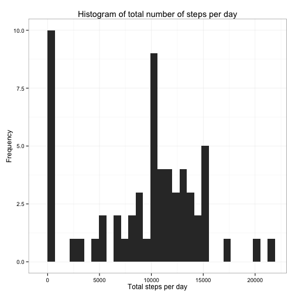
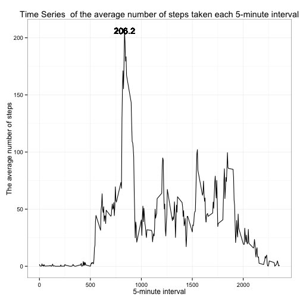
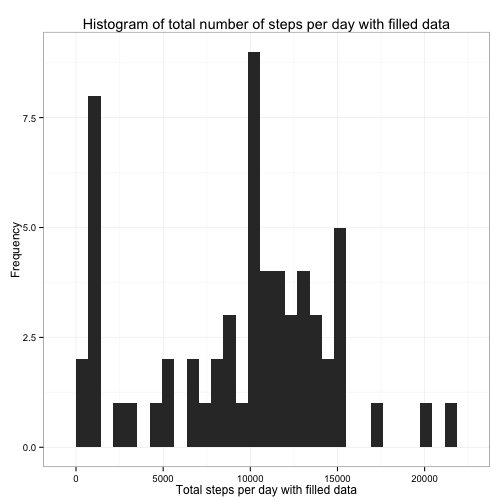
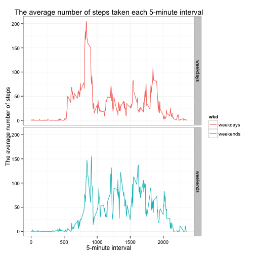

## Loading and preprocessing the data

```r
unzip("activity.zip", exdir = "data")
activity <- read.csv("data/activity.csv")
activity$date <- as.Date(activity$date, format = "%Y-%m-%d")
summary(activity)
```

```
##      steps             date               interval     
##  Min.   :  0.00   Min.   :2012-10-01   Min.   :   0.0  
##  1st Qu.:  0.00   1st Qu.:2012-10-16   1st Qu.: 588.8  
##  Median :  0.00   Median :2012-10-31   Median :1177.5  
##  Mean   : 37.38   Mean   :2012-10-31   Mean   :1177.5  
##  3rd Qu.: 12.00   3rd Qu.:2012-11-15   3rd Qu.:1766.2  
##  Max.   :806.00   Max.   :2012-11-30   Max.   :2355.0  
##  NA's   :2304
```
## What is mean total number of steps taken per day?

Calculate the total number of steps taken each day.

Calculate and report the **mean** and **median** total number of steps taken each day. 


```r
steps.total.day <- tapply(activity$steps, as.factor(activity$date), sum, na.rm = T)
mean(steps.total.day)
```

```
## [1] 9354.23
```

```r
median(steps.total.day)
```

```
## [1] 10395
```

Make a histogram of the total number of steps taken each day.

```r
library(ggplot2)
df <- data.frame(steps.total.day, date = names(steps.total.day))
g.total.day <- ggplot(df, aes(df$steps.total.day))
g.total.day + geom_histogram() +
        xlab("Total steps per day") +
        ylab("Frequency") +
        ggtitle("Histogram of total number of steps per day") + 
        theme_bw()
```

```
## stat_bin: binwidth defaulted to range/30. Use 'binwidth = x' to adjust this.
```

 

## What is the average daily activity pattern?
Caculate the average number of steps taken each 5-interval.
Draw a Time Series plot about this the average number of steps taken each 5-interval.
As we can see in the figure below, Which 5-minute interval, the maximum number of steps across all the days in the dataset is **206.2**, namely the **815 minitue**.

```r
library(ggplot2)
steps.mean.interval <- tapply(activity$steps, as.factor(activity$interval), mean, na.rm = TRUE)
df.mean.interval <- data.frame(interval = unique(activity$interval), steps.mean.interval)
g.mean.interval <- ggplot(df.mean.interval, aes(interval, steps.mean.interval, group = 1))
g.mean.interval + geom_line() +
        xlab("5-minute interval") +
        ylab("The average number of steps") +
        ggtitle("Time Series  of the average number of steps taken each 5-minute interval") + 
        theme_bw() + 
        geom_text(data = NULL,
                  x = as.numeric(names(which.max(steps.mean.interval))),
                  y = max(steps.mean.interval),
                  label = format(max(steps.mean.interval), digits=4)
                  )
```

 

## Imputing missing values

Fisrt, Calculate and report the total number of missing values.

```r
total.na <- sum(is.na(activity$steps))
total.na
```

```
## [1] 2304
```

Using the median of each 5-minitue to fill those `NA`s.


```r
act.split.interval <- split(activity, as.factor(activity$interval))
act.list.fill <- lapply(act.split.interval, 
                     function(act) {
                                act$steps[is.na(act$steps)] = median(act$steps, na.rm = TRUE)
                                act
                             }
                     )
activity.filled <- do.call(rbind, act.list.fill)
row.names(activity.filled) <- seq_along(1:nrow(activity.filled))
summary(activity.filled)
```

```
##      steps          date               interval     
##  Min.   :  0   Min.   :2012-10-01   Min.   :   0.0  
##  1st Qu.:  0   1st Qu.:2012-10-16   1st Qu.: 588.8  
##  Median :  0   Median :2012-10-31   Median :1177.5  
##  Mean   : 33   Mean   :2012-10-31   Mean   :1177.5  
##  3rd Qu.:  8   3rd Qu.:2012-11-15   3rd Qu.:1766.2  
##  Max.   :806   Max.   :2012-11-30   Max.   :2355.0
```

Make a histogram of the total number of steps taken each day and Calculate and report the **mean** and **median** total number of steps taken each day. 

```r
library(ggplot2)
steps.total.day.filled <- tapply(activity.filled$steps, as.factor(activity.filled$date), sum)
df.total.day.filled <- data.frame(steps.total.day.filled, date = names(steps.total.day.filled))
g.total.day.filled <- ggplot(df.total.day.filled, aes(steps.total.day.filled))
g.total.day.filled + geom_histogram() +
        xlab("Total steps per day with filled data") +
        ylab("Frequency") +
        ggtitle("Histogram of total number of steps per day with filled data") + 
        theme_bw()
```

```
## stat_bin: binwidth defaulted to range/30. Use 'binwidth = x' to adjust this.
```

 

```r
#calculate the mean total number of steps per day
mean(steps.total.day.filled)
```

```
## [1] 9503.869
```

```r
#calculate the median total number of steps per day
median(steps.total.day.filled)
```

```
## [1] 10395
```

As we can see from the result, the average value of total steps taken each day become a little greater than the estimates from the first part of the assignment.

The median value of total steps taken each day are equivalent to the estimates from the first part of the assignment.


## Are there differences in activity patterns between weekdays and weekends?

```r
#Caculate if the date is a weekday or weekend.
wkd <- weekdays(activity.filled$date)
wkd.names <- unique(wkd)
wkd[wkd %in% wkd.names[1:5]] <- "weekdays"
wkd[wkd %in% wkd.names[6:7]] <- "weekends"
activity.filled$wkd <- as.factor(wkd)
activity.filled$interval_wkd <- as.factor(paste(activity.filled$interval, activity.filled$wkd))

##Caculate the average value of total steps across all weekday days or weekend days 
steps.filled.mean.interval <- tapply(activity.filled$steps, activity.filled$interval_wkd, mean)
df.filled.mean.interval <- data.frame(interval_wkd = names(steps.filled.mean.interval), steps.filled.mean.interval)

##Split the interval_wkd colume into 2 parts
interval.wkd.list <- strsplit(as.character(df.filled.mean.interval$interval_wkd), split = " ")
interval <- as.numeric(sapply(interval.wkd.list, "[", 1))
wkd <- as.factor(sapply(interval.wkd.list, "[", 2))
df.filled.mean.interval$interval <- interval
df.filled.mean.interval$wkd <- wkd

##Plot
g.filled.mean.interval <- ggplot(df.filled.mean.interval, 
                                 aes(interval, steps.filled.mean.interval, group = wkd, colour = wkd))
g.filled.mean.interval + geom_line() +
        facet_grid(wkd~.) + 
        xlab("5-minute interval") +
        ylab("The average number of steps") +
        ggtitle("The average number of steps taken each 5-minute interval") + 
        theme_bw() 
```

 

As we can see from the figure, people are more likely to walk in the morning at weekdays while they are walk more often in the afternoon at weekends.
